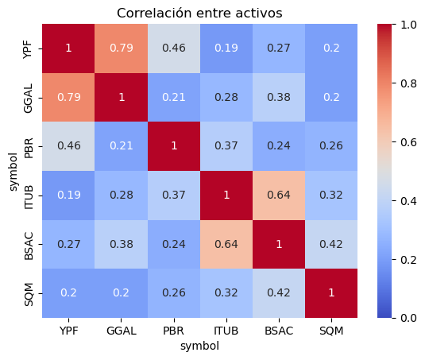
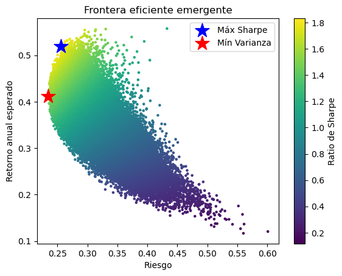
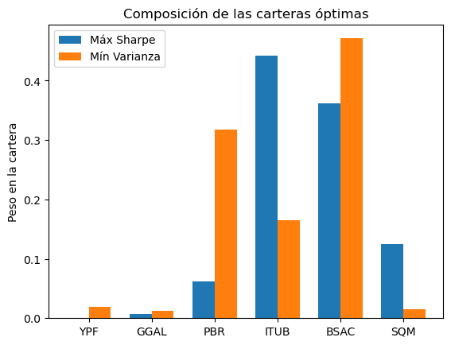
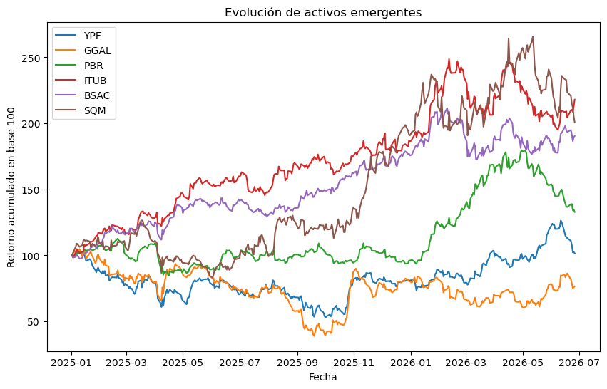

# Optimización de cartera emergente utilizando el modelo de Markowitz
Seleccioné 6 activos emergentes (3 energéticos y 3 financieros) y construí un portafolio eficiente aplicando la teoría de Markowitz

# Objetivo
Construir un portafolio eficiente seleccionando 6 activos líquidos, 2 por país. De Argentina seleccioné YPF y GGAL; de Brasil seleccioné PBR e ITUB; de Chile seleccioné BSAC y SQM.

# Datos y metodología
Seleccioné 6 acciones líquidas de dos sectores clave: energía y bancos. El período analizado va desde el 01-01-2025 hasta el 29-06-2026.
Simulé 100.000 carteras y calculé retornos históricos, matrices de covarianza, la frontera eficiente y el ratio de Sharpe. Librerías utilizadas: yahooquery, pandas, numpy, matplotlib, seaborn.

# Análisis y resultados
 

Las altas correlaciones entre YPF y GGAL son un hallazgo importante. Podría ser señal de que Argentina se mueve con drivers macro más que con fundamentals. ITUB y BSAC se mueven parecido al ser del sector financiero. El resto de correlaciones no es lo suficientemente alta. Una cartera así está relativamente diversificada.

 

La cartera de menor volatilidad se ubica en torno al 25% anual de riesgo con 40% de retorno. Se puede maximizar el Sharpe, llevando el riesgo a poco menos del 30% y subiendo los retornos por encima del 50% anual.

 

La cartera de máximo Sharpe se concentra en ITUB y la de mínima varianza en BSAC. Es de notar la falta de peso en la cartera de los activos argentinos seleccionados ¿Señal de que los retornos del país no justificaron su extrema volatilidad en el período analizado?

 

Las acciones argentinas seleccionadas fueron castigadas en el período analizado. El resto performó con retornos positivos

# Hallazgo central
La diversificación LATAM se redujo a invertir en los activos seleccionados de Brasil y Chile. Los activos YPF y GGAL no fueron seleccionados ni en la cartera de mínima varianza ni en la de máximo Sharpe.

# Limitaciones
Los análisis históricos no son predictivos. Conviene complementarlos con análisis macro y de fundamentals.

# Cómo correr el proyecto
Requisitos: Python, pandas, numpy, matplotlib, seaborn, yahooquery. Al correr el script se descargan los datos y se generan los gráficos.
